# skills-benchmark

A rigorous framework for **benchmarking agent skills** with isolated workflow integrity, statistical grounding, and blind comparative analysis.

## Overview

This repository implements a deterministic benchmarking harness designed to test and compare agent skills objectively:

- **Strict isolation**: Skills are physically relocated for baseline testing, then restored for comparison testing
- **Parallel execution**: Independent workers run in parallel with per-skill, per-eval, per-configuration granularity
- **Blind comparison**: Third-party evaluators judge outputs without knowing which implementation they're assessing
- **Comprehensive grading**: Results include quantitative metrics, per-eval comparisons, and anthropic best-practices synthesis
- **Generic framework**: Reusable for benchmarking skills in any domain

## How It Works

### Workflow at a Glance

The benchmark is intentionally **sequential across phases** and **parallel inside each phase**, but each phase also expands into a **full test matrix** rather than a single pass. In practice, every iteration replays the same `{skill × eval × config × run}` space for both baseline and `with_skill`, then compares matching eval/run pairs blindly before deciding whether to run another iteration.

```mermaid
flowchart TB
  classDef prep fill:#E8F1FF,stroke:#2F6FEB,stroke-width:1.5px,color:#0B1F33;
  classDef matrix fill:#EAF7FF,stroke:#1F6FEB,stroke-width:1.5px,color:#08294D;
  classDef phase fill:#EEF8EE,stroke:#2DA44E,stroke-width:1.5px,color:#132A13;
  classDef blind fill:#FFF4E5,stroke:#BF8700,stroke-width:1.5px,color:#5C3B00;
  classDef final fill:#F5E8FF,stroke:#8250DF,stroke-width:1.5px,color:#2E1065;
  classDef decision fill:#FFE5EC,stroke:#CF225B,stroke-width:1.5px,color:#4A1022;
  classDef note fill:#FFF8C5,stroke:#9A6700,stroke-dasharray: 4 3,color:#3D2E00;

  Start(["Start benchmark iteration"])
  Prep["Clean artifacts<br/>write protocol manifest<br/>run protocol-preflight"]
  Matrix["Expand benchmark matrix<br/>skills × evals × configs × runs"]

  subgraph Phase1["Phase 1 — without_skill baseline"]
    direction TB
    Disable["Relocate .github/skills/<br/>to _disabled-skills/"]
    BaselineWave["Launch baseline workers<br/>in parallel waves"]
    BaselineUnit["Repeat for every work unit<br/>skill × eval × config × run"]
    BaselineRuns["run-1, run-2, …, run-N<br/>for each eval/config pair"]
    Metrics1["Normalize & validate<br/>without_skill metrics"]
    Disable --> BaselineWave --> BaselineUnit --> BaselineRuns --> Metrics1
  end

  subgraph Phase2["Phase 2 — with_skill"]
    direction TB
    Restore["Restore .github/skills/"]
    WithSkillWave["Launch with_skill workers<br/>in parallel waves"]
    WithSkillUnit["Replay the same matrix<br/>skill × eval × config × run"]
    WithSkillRuns["run-1, run-2, …, run-N<br/>again with skill access"]
    Metrics2["Normalize & validate<br/>with_skill metrics"]
    Restore --> WithSkillWave --> WithSkillUnit --> WithSkillRuns --> Metrics2
  end

  subgraph Phase3["Phase 3 — blind comparison"]
    direction TB
    ResetBlind["Reset blind comparisons"]
    BlindPrep["Prepare blinded A/B bundles<br/>for each eval + run pair"]
    CompareWave["Launch comparator workers<br/>in parallel waves"]
    BlindPairs["Compare A vs B for<br/>eval-1/run-1 … eval-M/run-N"]
    BlindAgg["Aggregate winners, confidence<br/>and variance across runs"]
    ResetBlind --> BlindPrep --> CompareWave --> BlindPairs --> BlindAgg
  end

  subgraph Finalize["Finalize iteration"]
    direction TB
    Resume["Resume-finalize / aggregate"]
    Summary["Refresh suite summaries,<br/>blind-comparisons and reports"]
    Synthesis["Write per-skill synthesis.md<br/>with the next edits to try"]
    Resume --> Summary --> Synthesis
  end

  Stable{"Results stable enough<br/>or new changes worth testing?"}
  Improve["Refine skill, prompts<br/>or eval design"]
  Next(["Iteration N+1 repeats<br/>the full matrix"])
  End(["Keep / publish results"])

  NoteParallel["Parallelism is allowed inside each phase only;<br/>phase boundaries stay strictly sequential"]
  NoteVariance["Variance is estimated from repeated runs,<br/>not from a single best attempt"]
  NoteBlind["Blind judging stays aligned by eval + run,<br/>so A/B comparisons remain apples-to-apples"]

  Start --> Prep --> Matrix --> Disable
  Metrics1 --> Restore
  Metrics2 --> ResetBlind
  BlindAgg --> Resume
  Synthesis --> Stable
  Stable -- "Iterate" --> Improve --> Next --> Prep
  Stable -- "Stop" --> End

  BaselineWave -.-> NoteParallel
  WithSkillWave -.-> NoteParallel
  CompareWave -.-> NoteParallel
  BaselineRuns -.-> NoteVariance
  WithSkillRuns -.-> NoteVariance
  BlindPairs -.-> NoteBlind

  class Start,Prep prep;
  class Matrix,BaselineUnit,WithSkillUnit matrix;
  class Disable,BaselineWave,BaselineRuns,Metrics1,Restore,WithSkillWave,WithSkillRuns,Metrics2 phase;
  class ResetBlind,BlindPrep,CompareWave,BlindPairs,BlindAgg blind;
  class Resume,Summary,Synthesis,Improve,Next,End final;
  class Stable decision;
  class NoteParallel,NoteVariance,NoteBlind note;
```



- **Each benchmark iteration is a matrix, not a single run**: the harness expands work across every `skill`, `eval_id`, `configuration`, and repeated `run_number`.
- **Repeated runs are part of the measurement model**: `run-1 … run-N` are replayed for both baseline and `with_skill`, then rolled up into variance-aware summaries.
- **Blind comparison stays pairwise and fair**: every comparator run matches the same `eval_id` and `run_number` on both sides, rather than comparing aggregate blobs.
- **Baseline integrity still comes first**: the default `without_skill` path physically relocates `.github/skills/` before any baseline worker runs.
- **The workflow is iterative by design**: `synthesis.md` is the hand-off into the next round of skill edits, and iteration `N+1` reruns the full matrix to confirm whether the changes really helped.

### Three-Phase Comparison Strategy

The benchmark workflow isolates skill behavior through two sequential phases:

#### Phase 1: Without Skill (Baseline)
- Workspace skills are **physically relocated** to `test/<iteration>/_disabled-skills/`
- Isolated worker agents answer evaluation prompts using only repository knowledge
- This establishes a clean baseline for comparison
- Alternative: Use hook-only mode to keep skills present but isolated at the hook layer

#### Phase 2: With Skill (Enhanced)
- Skills are **restored** to `.github/skills/`
- Fresh worker agents answer the same evaluation prompts with skill access
- Results are normalized and validated against baseline metrics

#### Phase 3: Blind Comparison
- Both Phase 1 and Phase 2 responses are blinded (labeled as A/B)
- Independent comparators score outputs using a grading specification
- Scores are aggregated into confidence rankings and variance statistics
- Blind phase preserves evaluation integrity

### Worker Agents

The framework deploys **4 specialized worker agents** (plus 1 orchestrator):

| Agent | Role | Invocation |
|-------|------|-----------|
| **Skill Benchmark Manager** | Orchestrates all phases, coordinates workers, manages output aggregation | Manual trigger for full workflow |
| **Skill Benchmark Baseline** | Strict `without_skill` worker; answers evals with skills physically relocated | Invoked by manager, parallel waves |
| **Skill Benchmark Baseline Hook-Only** | Experimental `without_skill` probe; skills remain present but access controlled at hook layer | Invoked for isolation testing only |
| **Skill Benchmark With Skill** | `with_skill` worker; answers evals with skill access enabled | Invoked by manager, parallel waves |
| **Skill Blind Comparator** | Scores A/B responses blinded to which side is which; produces grading judgments | Invoked for blind phase |

### Execution Model

**Parallelism Strategy:**
- Within each phase: workers run in **parallel waves** at per-skill, per-eval granularity
- Across phases: phases are **strictly sequential** (no overlapping)
- Default work unit: `<skill, eval_id, configuration, run_number>`

**Phase Ordering (Mandatory):**
1. Clean benchmark artifacts (skip git-tracked iterations)
2. Write protocol manifest
3. Run protocol preflight checks
4. **Relocate skills** → Phase 1 starts
5. Run all `without_skill` workers (parallel)
6. Normalize & validate metrics
7. **Restore skills** → Phase 2 starts
8. Run all `with_skill` workers (parallel)
9. Normalize & validate metrics
10. **Run blind comparisons** (parallel)
11. Validate executable checks
12. Finalize & aggregate results
13. Generate synthesis reports per skill

### Trust & Isolation Rules

- **No skill contamination**: Baseline workers never read `SKILL.md` files
- **No MCP leakage**: Only narrowly scoped, benchmark-approved MCP reads are allowed for scored workers
- **No subagent escapes**: Boundary agents set `agents: []` (no further delegation)
- **Blind separation**: Comparators receive only paths, never see grading specs or expected outputs
- **Write scope limits**: Workers write only under `test/<iteration>/<skill>/`; no writes to scripts or meta directories
- **Session locking**: Each worker locks to one iteration after first write; cross-iteration writes rejected

## Quick Start

### Prerequisites
- Python 3.8+
- VS Code with GitHub Copilot enabled
- Workspace with `.github/skills/` directory containing skills to benchmark

### Install and Verify

For a reproducible local setup, follow [`docs/SETUP.md`](docs/SETUP.md).

Fast path:

- Create and activate a virtual environment
- Install dependencies from `requirements.txt`
- Run a harness smoke-check (`self-test`) on a dedicated iteration folder

If the smoke-check succeeds, your workspace is ready for either manager-driven runs (in Copilot chat) or CLI runs.

### Running a Benchmark

#### Minimal First Run (CLI, end-to-end)

Use this sequence when reusing the repository in a fresh workspace:

1. Create an iteration folder, for example: `test/benchmark-run-001/`
2. Generate protocol lock and preflight checks
3. Execute the benchmark workflow
4. Finalize and aggregate outputs

Example commands are documented in [`docs/SETUP.md`](docs/SETUP.md#minimal-first-run-cli).

#### Method 1: Via GitHub Copilot Agent (Recommended)

1. Open VS Code
2. Open the Copilot chat
3. Select agent: **Skill Benchmark Manager**
4. Run command (or plain request):
   ```
  Run a benchmark for test/benchmark-run-001 across all skills in .github/skills
   ```

By default, the workflow targets the skills present in `.github/skills/` for the selected iteration.

#### Method 2: Via Command Line

Activate the Python environment and run the skill suite tool:

```bash
source .venv/Scripts/activate  # Windows: .venv\Scripts\activate

# Run harness self-checks for an iteration workspace
python test/scripts/skill_suite_tools.py self-test \
  --iteration test/benchmark-run-001 \
  --workspace-root .

# Resume after interruption
python test/scripts/skill_suite_tools.py resume-finalize \
  --iteration test/benchmark-run-001 \
  --workspace-root .

# Clean generated review exports after benchmark
python test/scripts/skill_suite_tools.py prune-generated-artifacts \
  --iteration test/benchmark-run-001 \
  --workspace-root .
```

For a fully guided first run (including protocol and preflight steps), see [`docs/SETUP.md`](docs/SETUP.md).

### Recovery & Validation Commands (CLI)

For interruption recovery and stricter validation workflows, use:

- `resume-finalize` — recover missing blind materialisations and aggregate safely.
- `pre-aggregate-check` — fail-fast readiness validation before aggregation.
- `validate-metrics` and `normalize-metrics` — enforce canonical run-metrics schema.
- `validate-blind-isolation` — verify blind artifact isolation constraints.
- `validate-executable-checks` — run executable response checks.

The step-by-step command flow is documented in [`docs/SETUP.md`](docs/SETUP.md); full invariants remain in [`test/benchmark-agent-workflow.md`](test/benchmark-agent-workflow.md).

### Understanding Outputs

After a benchmark run, outputs are organized under `test/<iteration>/<skill>/`:

```
test/benchmark-run-001/
├── myskill/
│   ├── eval-001/
│   │   └── run-1/
│   │       └── response.md          # Worker answer
│   ├── with_skill-summary.json      # Phase 2 metrics
│   ├── without_skill-summary.json   # Phase 1 metrics
│   └── synthesis.md                 # Anthropic best-practices report
├── blind-comparisons.json           # Aggregated blind comparison results
├── suite-summary.json               # Iteration-level metrics
└── suite-summary.md                 # Human-readable summary
```

**Keep (canonical):**
- `/eval-**/` response directories
- `*-summary.json`, `blind-comparisons.json`
- `suite-summary.*`, `synthesis.md`

**Delete (disposable review exports):**
- `_skill-creator-review-workspace*/`
- `skill-creator-review.html`
- `skill-creator-benchmark.json`

## Repository Structure

```
.github/
├── agents/                          # 5 custom benchmark agent definitions
│   ├── skill-benchmark-manager.agent.md
│   ├── skill-benchmark-baseline.agent.md
│   ├── skill-benchmark-baseline-hook-only.agent.md
│   ├── skill-benchmark-with-skill.agent.md
│   └── skill-blind-comparator.agent.md
└── skills/                          # Workspace skills under test (templated)

test/
├── benchmark-agent-workflow.md      # Full workflow specification & invariants
├── benchmark-protocol.json          # Current protocol version manifest
├── scripts/
│   ├── skill_suite_tools.py        # Main harness CLI (4,280 lines)
│   ├── benchmark_access_hook.py    # Access control enforcement hook
│   └── benchmark/                   # Internal helper modules
├── _agent-hooks/                    # Runtime session tracking (generated)
└── _meta/                            # Metadata & validation logs (generated)

LICENSE                             # MIT
README.md                            # This file
```

Note: there is no mandatory root `.github/copilot-instructions.md` file for this repository workflow.

## Key Concepts

### Benchmark Protocol

The protocol version is tracked in [test/benchmark-protocol.json](test/benchmark-protocol.json), currently **`benchmark-v3`**. It includes:
- SHA256 signatures of all critical files (agents, hooks, main script)
- Artifact schema versions for backwards compatibility
- Generated timestamp for reproducibility

### Evaluation Model

Evals are organized by:
- **Skill**: The skill being tested (e.g., `myskill`)
- **Eval ID**: Unique prompt identifier within a skill
- **Configuration**: Run parameters (e.g., temperature, instruction variants)
- **Run Number**: Iteration count for variance analysis

### Metrics & Variance

Aggregated results include:
- Mean, median, std deviation, min/max per metric
- High-variance evals flagged for manual review
- Correlation analysis between skill-related metrics
- Confidence rankings from blind comparisons

### Synthesis & Best Practices

After each iteration, benchmark results feed into an **Anthropic skill-authoring best-practices pass** that reviews:
- **Concision**: Remove instructional fluff, keep only high-value guidance
- **Degrees of freedom**: Tune strictness to task fragility
- **Triggerability**: Verify `name`/`description` clearly state capability & trigger context
- **Progressive disclosure**: Keep core focused, delegate advanced details
- **Workflow quality**: Ensure complex tasks have clear steps and validation loops
- **Anti-pattern scan**: Flag vague wording, option overload, stale guidance, platform pitfalls

Output: `test/<iteration>/<skill>/synthesis.md` (evidence-based quality report)

#### How synthesis is produced (practical flow)

The synthesis is not free-form commentary; it is generated from structured benchmark evidence:

1. Build the evidence bundle:
  - `synthesis-bundle --iteration <path> --workspace-root . --skill <name>`
2. Use `synthesis_template` from that bundle **verbatim** as the report skeleton.
3. Fill each placeholder with measured data from:
  - `quantitative` (rates, deltas, variance)
  - `per_eval_comparisons` (winner/confidence/reasoning)
  - `executable_details` and `high_variance_evals`
4. Persist the final report:
  - `write-synthesis --iteration <path> --workspace-root . --skill <name>`

Result: `synthesis.md` becomes the actionable bridge between raw metrics and concrete skill edits for the next iteration.

## Configuration

### Environment Variables

- `BENCH_MODE`: `benchmark_manager` | `baseline` | `baseline_hook_only` | `with_skill_targeted` | `blind_compare`
- `BENCH_TRACE_LEVEL`: `normal` | `audit` | `debug` (default: `normal`)
- `BENCH_ALLOWED_AGENTS`: Comma-separated list of agent names allowed in this session

### Hook Configuration

Access control and isolation are enforced by `.github/agents/<name>.agent.md` hook definitions:
- `SessionStart`, `PreToolUse`, `SubagentStart` hooks run `test/scripts/benchmark_access_hook.py`
- Hook timeout: 15 seconds
- Mode determines allowed scopes (read/write permissions, MCP access)

## Advanced Workflows

### Cross-Iteration Comparison

Compare results across multiple iterations:

```bash
python test/scripts/skill_suite_tools.py compare-iterations \
  --baseline test/myskill-test1 \
  --target test/myskill-test2 \
  --workspace-root .
```

### Hook Debugging

Enable detailed hook tracing:

```bash
BENCH_TRACE_LEVEL=debug python test/scripts/skill_suite_tools.py self-test \
  --iteration test/myskill-test3 \
  --workspace-root .
```

Hook audit logs written to `test/_agent-hooks/hook-audit.jsonl`

### Exporting for External Review

Generate a review workspace for human evaluation:

```bash
python test/scripts/skill_suite_tools.py export-review-workspace \
  --iteration test/benchmark-run-001 \
  --workspace-root .
```

Then generate static HTML review:
```bash
python test/scripts/skill_suite_tools.py write-static-review \
  --iteration test/benchmark-run-001 \
  --workspace-root .
```

## Design Decisions

### Why two-phase with relocation?

Physical relocation creates an **unambiguous** baseline. It's more robust than access control alone because:
- Eliminates any possible skill file leakage
- Makes isolation failures immediately obvious (skills don't exist)
- Provides a reproducible baseline that's easier to audit

### Why parallel workers?

Parallel execution within a phase:
- Reduces total benchmark time from hours to minutes
- Maintains statistical independence (each worker has isolated session)
- Each work unit is granular enough to prevent resource contention

### Why blind comparison?

Blind evaluation prevents:
- Evaluator bias (knowing which is "new skill" vs "baseline")
- Anchoring on earlier results
- Favoritism toward one side

Independent graders score the same outputs, with results aggregated by confidence and variance.

### Why synthesis is mandatory?

Benchmark results don't directly translate to skill improvements. Synthesis explicitly:
- Grounds claims in evidence (not intuition)
- Checks for methodological issues (high variance, outliers)
- Identifies actionable patterns (token economy, constraint brittleness)
- Prevents skill bloat or misguided rewrites

## Maintenance & Cleanup

### Clean up runtime artifacts:

```bash
cd test
rm -rf __pycache__ .github/agents/scripts/__pycache__
# Keep: .github/agents/*.agent.md, benchmark-protocol.json, benchmark-agent-workflow.md
```

### Reset all iteration directories (⚠️ destructive):

```bash
git clean -fdx test/

```

### Run tests:

```bash
python test/scripts/tests/test_skill_suite_tools.py
```

## Documentation

- [Full Workflow Specification](test/benchmark-agent-workflow.md) – detailed phase descriptions, trust rules, output contracts
- [Benchmark Protocol](test/benchmark-protocol.json) – current protocol version and artifact schemas
- [Setup and Reuse Guide](docs/SETUP.md) – reproducible environment setup and first benchmark run
- [Troubleshooting Guide](docs/TROUBLESHOOTING.md) – common failures and targeted fixes
- [CLI command help](test/scripts/skill_suite_tools.py) – operational command surface and compatibility flags
- `.github/agents/*.agent.md` – individual agent operating rules and constraints

## Contributing

To extend or modify the benchmark harness:

1. Edit agent definitions in `.github/agents/`
2. Update hook logic in `test/scripts/benchmark_access_hook.py`
3. Modify workflow commands in `test/scripts/skill_suite_tools.py`
4. Update `test/benchmark-protocol.json` with new file hash if critical files change
5. Document changes in `test/benchmark-agent-workflow.md`

## License

MIT License – see [LICENSE](LICENSE)
